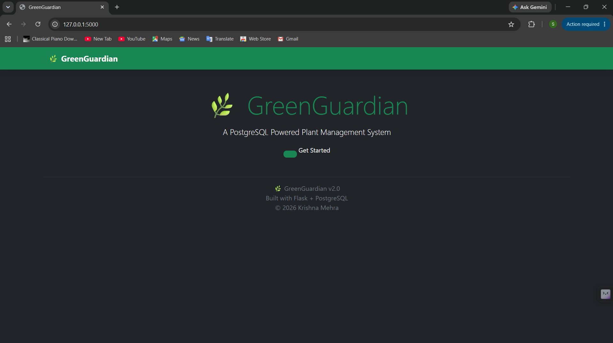
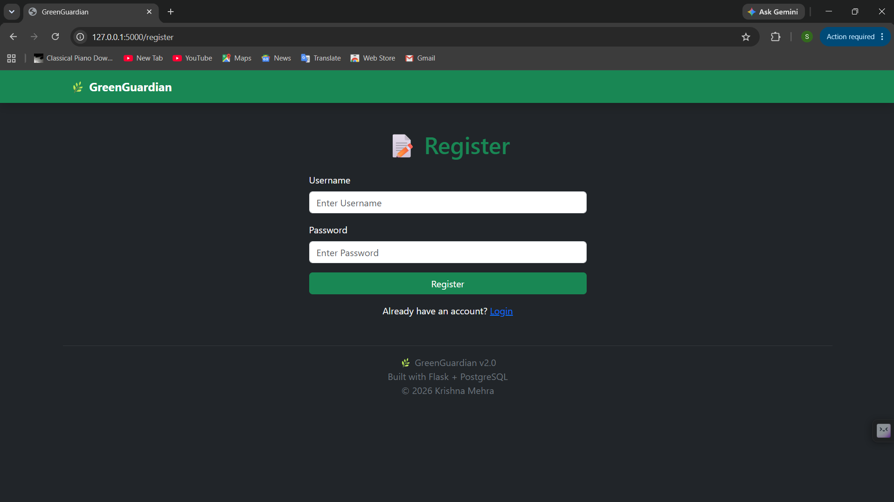
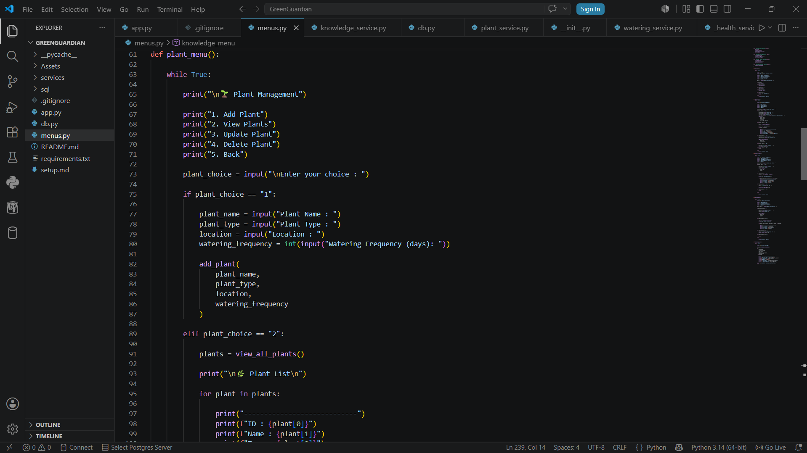
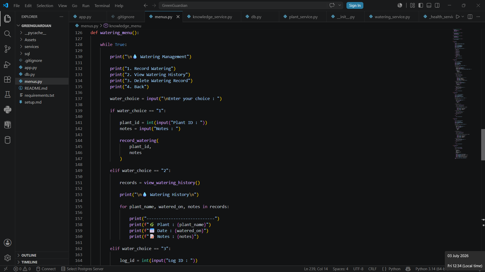
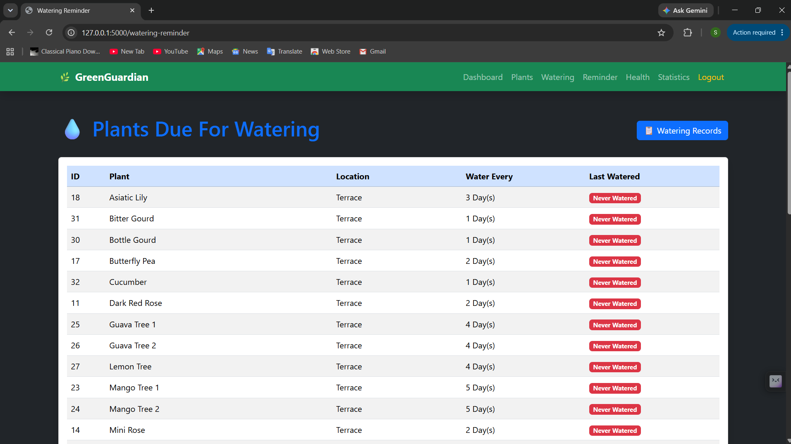
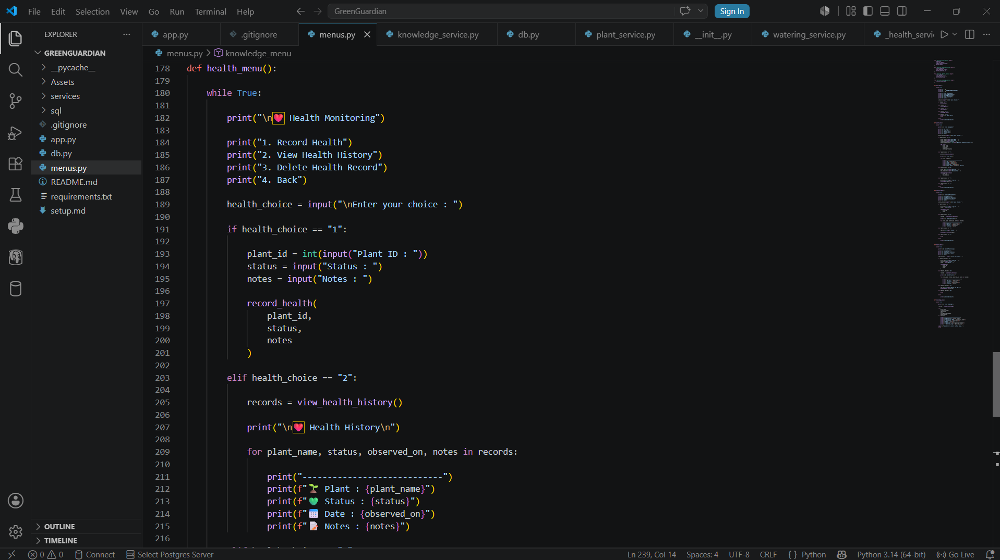
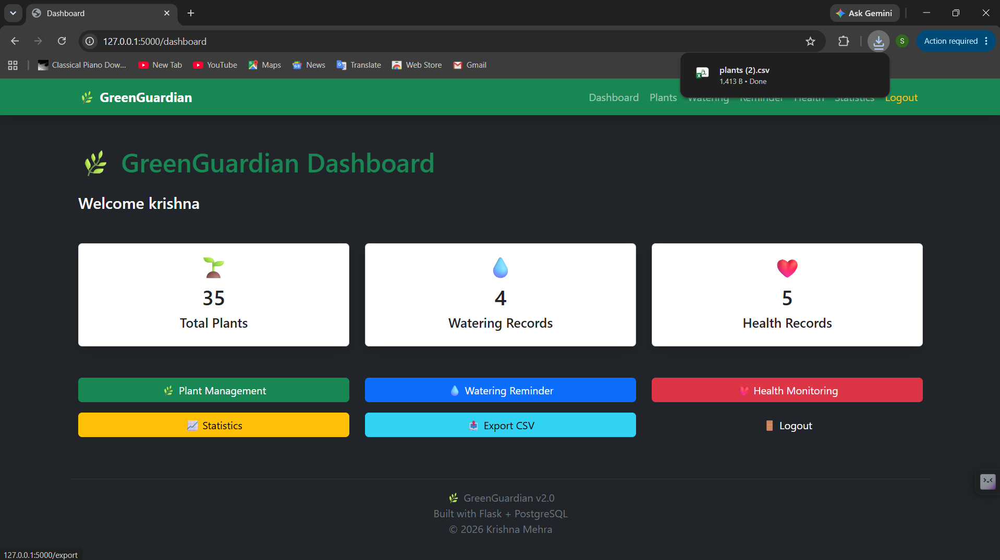

<p align="center">
  
</p>

<h1 align="center">🌿 GreenGuardian</h1>

<p align="center">

A Full-Stack Plant Care & Knowledge Management System built with Flask and PostgreSQL

</p>

<p align="center">


</p>

---

# 📖 About GreenGuardian

GreenGuardian is a modern **Plant Care & Knowledge Management System** designed to help users efficiently organize and monitor their plant collections.

The application enables users to manage plant records, track watering schedules, monitor plant health, analyze statistics, export records, and receive smart watering reminders through an intuitive web interface.

Originally developed as a Command Line Interface (CLI) application, GreenGuardian was later upgraded into a full-stack Flask web application featuring authentication, responsive Bootstrap UI, PostgreSQL integration, and modular service-based architecture.

---

# ✨ Key Highlights

- 🌱 Complete Plant Management System
- 🔐 User Authentication & Session Management
- 💧 Smart Watering Reminder
- ❤️ Plant Health Monitoring
- 📊 Statistics Dashboard
- 🔍 Search & Filtering
- 📤 CSV Export
- 🎨 Responsive Bootstrap Interface
- 🗄 PostgreSQL Database
- ⚙ Modular Flask Architecture

---

# 🚀 Features

## 🔐 Authentication

- User Registration
- Secure Login
- Logout
- Session Management
- Flash Messages

---

## 🌱 Plant Management

- Add Plants
- Edit Plant Details
- Delete Plants
- View All Plants
- Search Plants
- Filter by Type
- Filter by Location
- Filter by Watering Frequency

---

## 💧 Watering Management

- Record Watering
- View Watering History
- Delete Watering Records
- Smart Watering Reminder
- Due Plants List

---

## ❤️ Health Monitoring

- Record Plant Health
- View Health History
- Delete Health Records
- Track Plant Status

---

## 📊 Statistics Dashboard

Live PostgreSQL statistics including:

- Plants by Type
- Plants by Location
- Watering Frequency Distribution

---

## 📤 Export Module

Export data into CSV files:

- Plants
- Watering History
- Health History

---

## 🎨 User Interface

- Bootstrap 5
- Responsive Layout
- Professional Dashboard
- Navigation Bar
- Flash Notifications
- Dark Theme

---

# 🏗 System Architecture

```text
                User
                  │
                  ▼
          Flask Web Application
                  │
      ┌───────────┼────────────┐
      ▼           ▼            ▼
 Authentication  Plant      Dashboard
                 Module      Module
      ▼           ▼            ▼
 Watering     Health      Export Module
      └───────────┼────────────┘
                  ▼
            PostgreSQL Database
```

---

# 🛠 Tech Stack

| Category | Technologies |
|----------|--------------|
| Language | Python |
| Backend | Flask |
| Frontend | HTML5, Bootstrap 5, Jinja2 |
| Database | PostgreSQL |
| Database Driver | psycopg2 |
| Version Control | Git & GitHub |
| IDE | Visual Studio Code |

---

# 📂 Project Structure

```text
GreenGuardian/
│
├── app.py
├── db.py
├── requirements.txt
├── README.md
│
├── services/
│   ├── auth_service.py
│   ├── dashboard_service.py
│   ├── export_service.py
│   ├── health_service.py
│   ├── plant_service.py
│   └── watering_service.py
│
├── templates/
│   ├── base.html
│   ├── index.html
│   ├── login.html
│   ├── register.html
│   ├── dashboard.html
│   ├── plants.html
│   ├── add_plant.html
│   ├── edit_plant.html
│   ├── watering.html
│   ├── add_watering.html
│   ├── watering_reminder.html
│   ├── health.html
│   ├── add_health.html
│   └── statistics.html
│
├── static/
│
├── Assets/
│   └── project_images/
│
└── exports/
```

---

# 📸 Project Screenshots

## 🏠 Home Page

<p align="center">

</p>

---

## 🔐 Login

<p align="center">

</p>

---

## 📝 Register

<p align="center">

</p>

---

## 📊 Dashboard

<p align="center">

</p>

---

## 🌱 Plant Management

<p align="center">

</p>

GreenGuardian provides a complete Plant Management module that enables users to:

- Add new plants
- Edit existing plant details
- Delete plant records
- Search plants
- Filter plants by Type
- Filter plants by Location
- Filter plants by Watering Frequency

---

## 📊 Statistics Dashboard

<p align="center">

</p>

The Statistics Dashboard provides a quick overview of the entire garden using live PostgreSQL data.

### Available Statistics

- 🌱 Plants by Type
- 📍 Plants by Location
- 💧 Watering Frequency Distribution

---

## 💧 Watering Management

<p align="center">

</p>

The Watering Module allows users to:

- Record watering history
- View previous watering records
- Delete watering records
- Maintain watering logs

This helps users maintain a consistent watering schedule for every plant.

---

## 🌧 Smart Watering Reminder

<p align="center">

</p>

One of GreenGuardian's most useful features.

The Reminder System automatically determines which plants require watering today by comparing:

- Last Watered Date
- Watering Frequency

Plants that have never been watered are also identified automatically.

---

## ❤️ Health Monitoring

<p align="center">

</p>

The Health Monitoring module allows users to:

- Record plant health
- Track plant status
- Store observations
- Delete health records

Supported health statuses include:

- Healthy
- Needs Attention
- Diseased
- Recovering

---

## 📤 CSV Export

<p align="center">

</p>

GreenGuardian supports exporting application data into CSV format.

Available exports include:

- Plant Records
- Watering History
- Health Records

The exported files can be opened directly in Microsoft Excel or Google Sheets.

---

# 🚀 Installation Guide

## 1️⃣ Clone Repository

```bash
git clone https://github.com/YOUR_USERNAME/GreenGuardian.git
```

---

## 2️⃣ Navigate into Project

```bash
cd GreenGuardian
```

---

## 3️⃣ Install Dependencies

```bash
pip install -r requirements.txt
```

---

## 4️⃣ Configure PostgreSQL

Create a PostgreSQL database.

Update the connection details inside:

```text
db.py
```

with your:

- Database Name
- Username
- Password
- Host
- Port

---

## 5️⃣ Create Database Tables

Execute the SQL scripts located inside the `sql/` folder.

Example:

```sql
plants.sql
users.sql
health_logs.sql
watering_logs.sql
```

---

## 6️⃣ Run Application

```bash
python app.py
```

---

## 7️⃣ Open Browser

```text
http://127.0.0.1:5000
```

---

# 🗄 Database Design

GreenGuardian uses PostgreSQL as its backend database.

### Tables

| Table | Purpose |
|--------|---------|
| users | User authentication |
| plants | Plant information |
| watering_logs | Watering history |
| health_logs | Health monitoring records |

---

### Relationships

```text
Users
   │
   └──────────────┐
                  │
               Plants
                  │
      ┌───────────┴───────────┐
      ▼                       ▼
Watering Logs          Health Logs
```

---

# 🔄 Application Workflow

```text
User

 │

 ▼

Login

 │

 ▼

Dashboard

 │

 ├──────────────┐

 ▼              ▼

Plant        Watering

 │              │

 ▼              ▼

Health      Reminder

 │              │

 └──────┬───────┘

 ▼

Statistics

 │

 ▼

CSV Export
```

---

# 📈 Project Statistics

### Development Type

✔ Full Stack Web Application

---

### Database

✔ PostgreSQL

---

### Backend

✔ Flask

---

### Frontend

✔ HTML5

✔ Bootstrap 5

✔ Jinja2

---

### Architecture

✔ Modular Service-Based Architecture

---

### Authentication

✔ Session-Based Login System

---

### Export

✔ CSV Export

---

### Responsive Design

✔ Bootstrap Responsive Layout

---

# 🎯 Skills Demonstrated

This project demonstrates practical experience with:

### Backend Development

- Python Programming
- Flask Web Framework
- REST-style Routing
- Service-Based Architecture
- CRUD Operations
- Session Management

---

### Database Management

- PostgreSQL
- SQL Queries
- JOIN Operations
- GROUP BY Queries
- Aggregate Functions
- Database Relationships

---

### Frontend Development

- HTML5
- Bootstrap 5
- Responsive Design
- Jinja2 Templates
- Flash Messages
- Navigation Bar

---

### Software Engineering

- Modular Code Organization
- MVC-inspired Structure
- Git Version Control
- GitHub Workflow
- Debugging & Bug Fixing
- Documentation

---

# 📚 Learning Outcomes

During the development of GreenGuardian, I gained hands-on experience in:

- Building Full-Stack Flask Applications
- Designing Relational Databases
- Implementing Authentication Systems
- Creating Responsive User Interfaces
- Managing Sessions & User Authentication
- Writing Modular Service-Based Code
- Integrating PostgreSQL with Flask
- Exporting Data in CSV Format
- Debugging Real-World Software Issues
- Organizing Professional Project Structure

---

# 🧩 Challenges Faced & Solutions

| Challenge | Solution |
|-----------|----------|
| Migrating from CLI to Flask | Redesigned the application into a modular web architecture |
| Managing database relationships | Used PostgreSQL JOIN operations efficiently |
| Session Management | Implemented Flask sessions for secure authentication |
| Delete functionality bugs | Fixed routing and template parameter issues |
| Search & Filtering | Created reusable service functions for flexible filtering |
| Watering Reminder Logic | Used SQL aggregation with date arithmetic to determine due plants |
| CSV Export | Built dedicated export services for each module |

---

# 🚀 Future Roadmap

GreenGuardian is designed to be extended with additional smart features.

### Version 3.0

- 📈 Interactive Charts using Chart.js
- 🌦 Weather API Integration
- 🖼 Plant Image Upload
- 🔔 Email Notifications
- 📱 Improved Mobile Responsiveness

### Version 4.0

- 🤖 AI-Based Plant Disease Detection
- ☁ Cloud Deployment
- 📲 Android Application
- 📷 QR Code for Individual Plants
- 📊 Advanced Analytics Dashboard
- 🌍 Multi-user Garden Management

---

# 💡 Why GreenGuardian?

Plant care often becomes difficult when managing multiple plants with different watering schedules and health conditions.

GreenGuardian was developed to simplify plant management by providing:

- A centralized plant database
- Automated watering reminders
- Health tracking
- Statistics dashboard
- Exportable records
- Easy-to-use web interface

The project combines practical software engineering concepts with a real-world use case.

---

# 🏆 Project Highlights

✔ Flask Full-Stack Web Application

✔ PostgreSQL Database Integration

✔ User Authentication

✔ Complete CRUD Operations

✔ Smart Watering Reminder

✔ Health Monitoring

✔ Statistics Dashboard

✔ CSV Export

✔ Responsive Bootstrap Interface

✔ Modular Service-Based Architecture

---

# 📦 Requirements

Install the required Python packages:

```bash
pip install -r requirements.txt
```

Main dependencies include:

- Flask
- psycopg2
- tabulate

---

# 👨‍💻 Developer

## Krishna Mehra

**B.Tech – Computer Science & Engineering (AI & Data Engineering)**

Lovely Professional University

Punjab, India

### Connect with Me

- LinkedIn: https://www.linkedin.com/in/krishna-mehra-4365113a0/
- GitHub: https://github.com/YOUR_GITHUB_USERNAME

---

# 🙏 Acknowledgements

Special thanks to:

- Flask Documentation
- PostgreSQL Documentation
- Bootstrap Documentation
- Python Community
- Lovely Professional University
- Futurense Technologies Bootcamp

Their learning resources and documentation greatly supported the development of this project.

---

# 📄 License

This project is licensed under the **MIT License**.

Feel free to use, modify, and contribute while giving appropriate credit.

---

# ⭐ If You Like This Project

If you found GreenGuardian useful or inspiring:

⭐ Star this repository

🍴 Fork it

🛠 Contribute with improvements

🐛 Report bugs

💡 Suggest new features

---

# 🌿 GreenGuardian Development Journey

```
CLI Application
       │
       ▼
PostgreSQL Integration
       │
       ▼
Modular Service Layer
       │
       ▼
Flask Migration
       │
       ▼
Authentication
       │
       ▼
Dashboard
       │
       ▼
Plant Management
       │
       ▼
Watering Module
       │
       ▼
Health Monitoring
       │
       ▼
Statistics Dashboard
       │
       ▼
CSV Export
       │
       ▼
Responsive Bootstrap UI
       │
       ▼
GreenGuardian v2.0 ✅
```

---

<div align="center">

## 🌿 GreenGuardian v2.0

### Smart Plant Care & Knowledge Management System

**Built with ❤️ using Python, Flask & PostgreSQL**

---

⭐ **If you enjoyed this project, don't forget to give it a star!**

© 2026 Krishna Mehra. All Rights Reserved.

</div>
