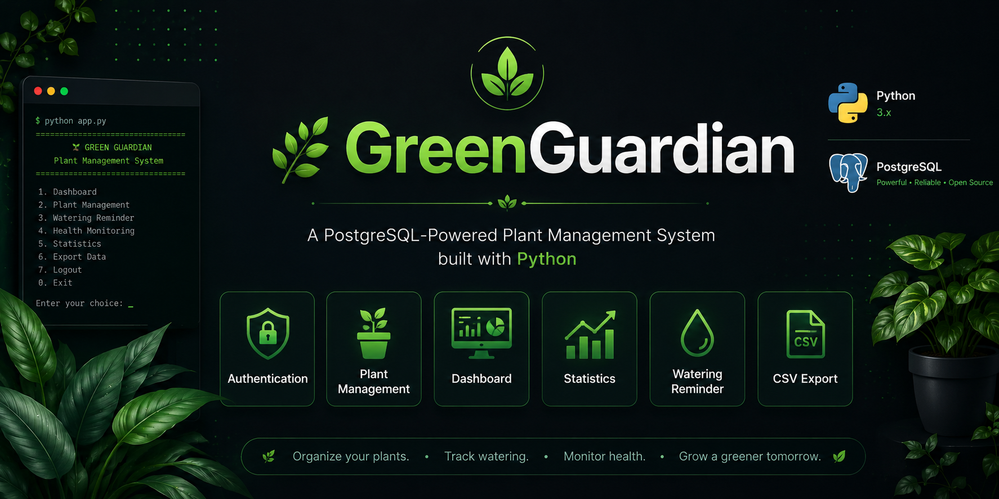
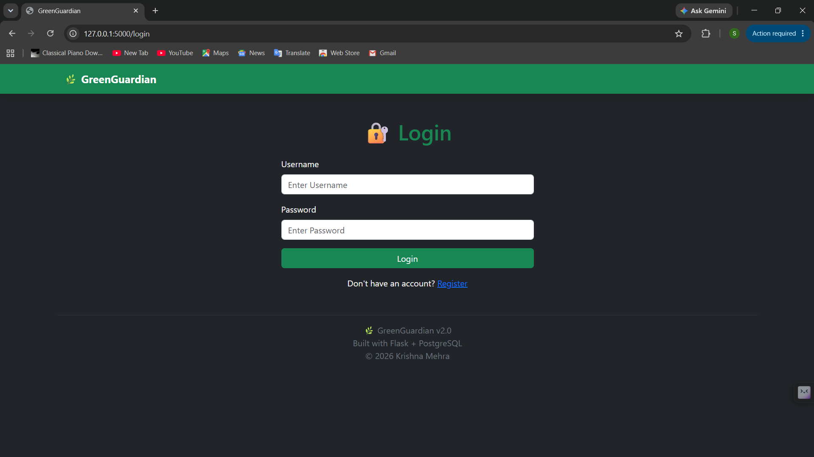
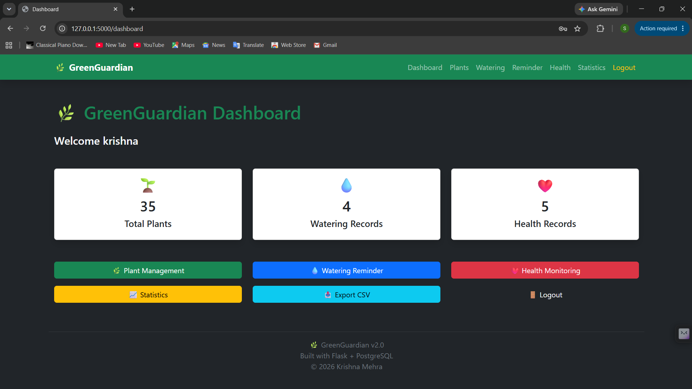
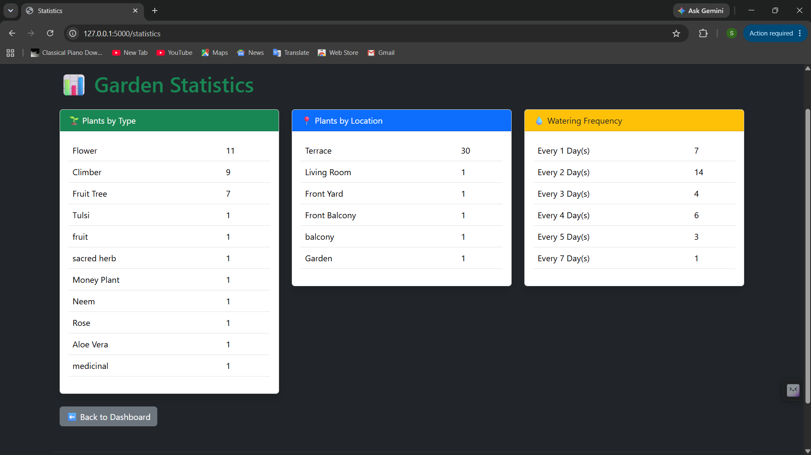

<p align="center">
  
</p>

<h1 align="center">🌿 GreenGuardian</h1>

<p align="center">
A PostgreSQL-Powered Plant Management System built with Python
</p>

<p align="center">


</p>

---

# 📖 About

GreenGuardian is a modular **Plant Management System** developed using **Python** and **PostgreSQL**. It helps users efficiently manage plant records, watering schedules, health monitoring, plant knowledge, and garden statistics through a clean, menu-driven interface.

The project demonstrates database-driven application development using modular Python architecture and serves as a strong foundation for future web and AI-powered gardening solutions.

---

# ✨ Features

## 🔐 Authentication
- User Registration
- Secure Login
- Session Management

## 🌱 Plant Management
- Add Plant
- View Plants
- Update Plant
- Delete Plant
- Search Plants
- Filter Plants

## 💧 Watering Management
- Record Watering
- Watering History
- Automatic Watering Reminder
- Delete Watering Records

## ❤️ Health Monitoring
- Record Plant Health
- View Health History
- Delete Health Records

## 📊 Dashboard & Statistics
- Total Plants
- Watering Records
- Health Records
- Plants by Type
- Plants by Location
- Watering Frequency Statistics

## 📚 Plant Knowledge
- Built-in Plant Information Module

## 📤 CSV Export
- Export Plants
- Export Watering Logs
- Export Health Logs
- Export Complete Database

---

# 🛠 Tech Stack

| Technology | Purpose |
|------------|---------|
| Python | Application Logic |
| PostgreSQL | Database |
| psycopg2 | Database Connectivity |
| Tabulate | Table Formatting |
| CSV | Data Export |
| Git | Version Control |
| GitHub | Repository Hosting |
| VS Code | Development Environment |

---

# 📂 Project Structure

```
GreenGuardian/
│
├── Assets/
│   └── project_images/
│
├── exports/
│
├── services/
│   ├── auth_service.py
│   ├── dashboard_service.py
│   ├── export_service.py
│   ├── health_service.py
│   ├── knowledge_service.py
│   ├── plant_service.py
│   └── watering_service.py
│
├── sql/
│   ├── schema.sql
│   └── users.sql
│
├── app.py
├── menus.py
├── db.py
├── session.py
├── ui.py
├── requirements.txt
└── README.md
```

---

# 🗄 Database

**Database Name**

```
greenguardian
```

### Tables

- users
- plants
- watering_logs
- health_logs

---

# 📸 Project Screenshots

> *(Add screenshots inside `Assets/project_images/` and replace the image paths below.)*

### 🔐 Login



---

### 🌱 Plant Management


---

### 📊 Dashboard



---

### 💧 Watering Reminder


---

### 📈 Statistics



---

### 📤 CSV Export


---

# ⚙ Installation

### 1️⃣ Clone Repository

```bash
git clone https://github.com/krishnamm26790-stack/GreenGuardian.git
```

### 2️⃣ Open Project

```bash
cd GreenGuardian
```

### 3️⃣ Install Dependencies

```bash
pip install -r requirements.txt
```

### 4️⃣ Create PostgreSQL Database

```sql
CREATE DATABASE greenguardian;
```

### 5️⃣ Execute SQL Files

Run

```
schema.sql
```

followed by

```
users.sql
```

### 6️⃣ Start Application

```bash
python app.py
```

---

# 💻 Current Features

✅ Authentication

✅ Session Management

✅ Plant Management

✅ Search

✅ Filters

✅ Dashboard

✅ Statistics

✅ Watering Reminder

✅ Health Monitoring

✅ CSV Export

---

# 🚀 Future Roadmap

## 🌐 Version 3

- Flask Web Application
- HTML
- CSS
- Bootstrap
- Responsive UI
- Improved User Experience

---

## 🚀 Version 4

- CSV Import
- Weather API Integration
- Charts & Analytics
- Image Upload Support
- User Profiles
- Deployment

---

## 🤖 Version 5

- AI Plant Doctor
- AI Chatbot
- Smart Watering Recommendation
- Disease Detection using Computer Vision
- AI Garden Analytics

---

# 🎯 Motivation

GreenGuardian was created to simplify plant care by providing an organized platform for managing plant records, watering schedules, health monitoring, and garden analytics.

The long-term vision is to transform GreenGuardian into a complete AI-powered gardening assistant capable of providing intelligent recommendations and plant disease detection.

---

# 💡 Challenges

During development, one of the biggest challenges was designing a modular backend architecture while integrating PostgreSQL with multiple independent service modules.

Building authentication, dashboard analytics, statistics, search, filters, reminders, and CSV export required careful database design and modular programming practices.

---

# 📚 Learning Outcomes

Through this project I gained practical experience in:

- Python Project Architecture
- PostgreSQL Database Design
- SQL Queries
- CRUD Operations
- Authentication Systems
- Session Management
- Modular Programming
- CSV File Handling
- Git & GitHub
- Software Project Organization

---

# 👨‍💻 Developer

## Krishna Mehra

**B.Tech CSE (AI & Data Engineering)**

Lovely Professional University

Department of AI & Emerging Technologies

Punjab, India 🇮🇳

### LinkedIn

https://www.linkedin.com/in/krishna-mehra-4365113a0/

---

# 📜 License

This project is licensed under the **MIT License**.

---

# ⭐ Support

If you found this project useful, consider giving it a **⭐ Star** on GitHub.

Your support motivates future development and helps the project grow.

---

<h3 align="center">
🌿 Grow Smarter • Water Better • Garden Greener 🌿
</h3>
